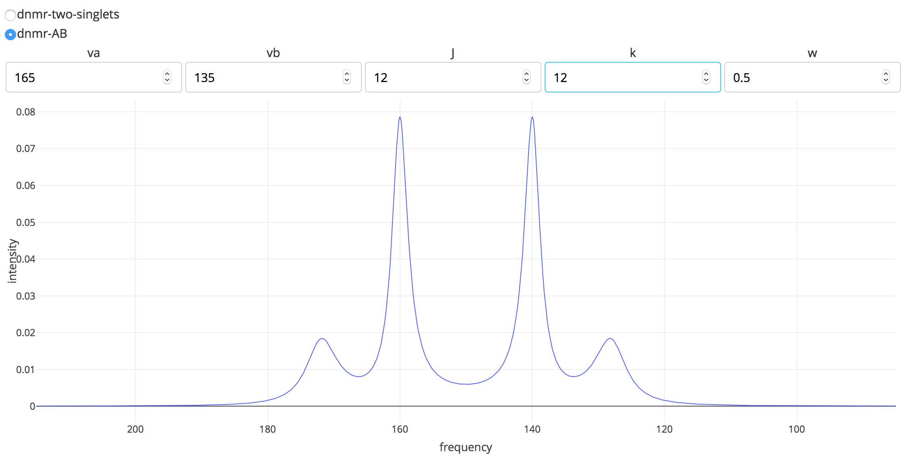

pyDNMR-Web v0.2.0 (pre-alpha)
*****************************

A port of pyDNMR to a web application, using Dash by plot.ly.

Link to the pyDNMR project, which includes stand-alone executable applications
for Windows and OS X, here_.

.. _here: https://github.com/sametz/pydnmr

The app is intended to be deployed to a web server. However, downloading the
code and installing the requirements in requirements.txt should allow you to
launch the app in your own browser locally.
